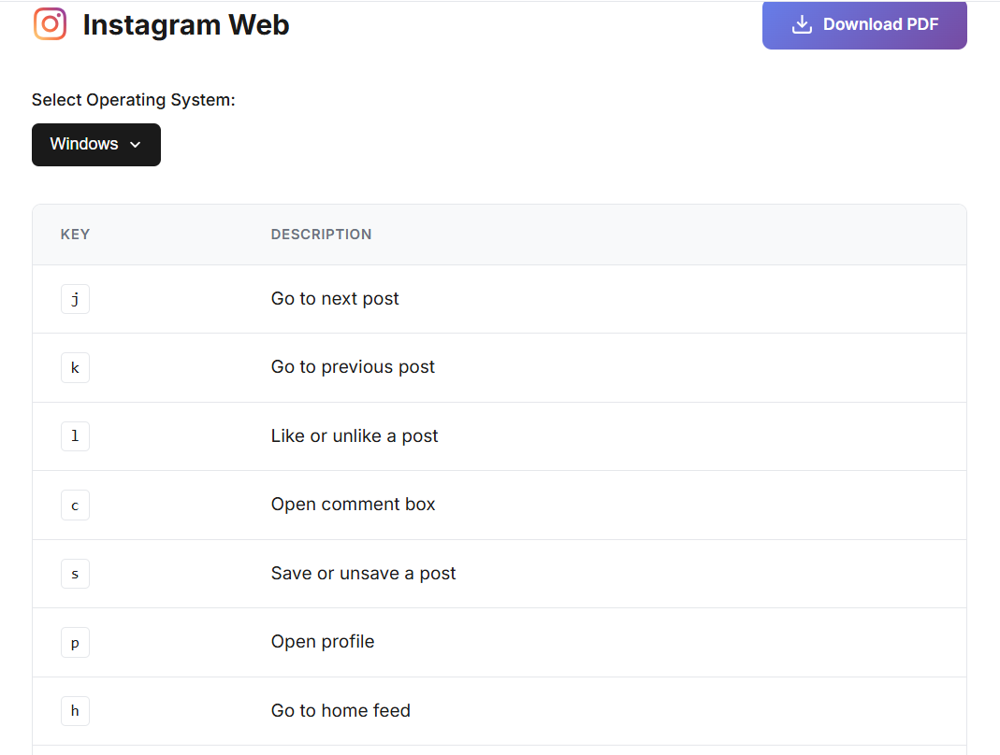

# HOTKEYS - MAYA 🎯

> **Learn the Hotkeys, kill your 🐭**

A comprehensive, beautifully designed web application for learning keyboard shortcuts across 23+ popular applications. Elevate your productivity by ditching the mouse and mastering the keys!


## 🌟 Features

- **23+ Applications**: Comprehensive keyboard shortcuts for popular tools including:
  - Development: VS Code, IntelliJ IDEA, Android Studio
  - Design: Figma, Adobe Photoshop, Adobe Illustrator, Canva
  - Productivity: Notion, Slack, Discord, Skype
  - Office: Microsoft Word, Excel, PowerPoint, Google Docs
  - Browsers: Chrome, Firefox, Edge
  - Operating Systems: Windows, macOS
  - Social: Instagram, YouTube

- **OS-Specific Shortcuts**: Seamlessly switch between Windows and macOS keyboard shortcuts
- **PDF Export**: Download shortcuts for offline reference
- **Interactive Mouse Counter**: Track your journey to becoming a keyboard ninja
- **Smooth Animations**: Auto-scrolling app carousel with pause on hover
- **Fully Responsive**: Works perfectly on desktop, tablet, and mobile devices
- **Search Functionality**: Quickly find the app you need
- **Dark-Themed UI**: Easy on the eyes with a modern gradient design

## 🚀 Live Demo

Visit the live application: [HOTKEYS - MAYA](https://hotkeys-maya.vercel.app)

## 📸 Screenshots

### Home Page


### Hotkeys View


## 🛠️ Technologies Used

- **HTML5**: Semantic structure
- **CSS3**: Modern styling with Grid & Flexbox
- **Vanilla JavaScript**: No frameworks, pure performance
- **Local Storage**: Persist user preferences
- **Google Fonts**: Inter font family
- **SVG Icons**: Scalable vector graphics for crisp icons

## 📦 Installation

### Clone the Repository

```bash
git clone https://github.com/Mahideep16/Hotkeys-Maya.git
cd Hotkeys-Maya
```

### Run Locally

Simply open `index.html` in your browser, or use a local server:

```bash
# Using Python
python -m http.server 8080

# Using Node.js (http-server)
npx http-server

# Using PHP
php -S localhost:8080
```

Then visit `http://localhost:8080` in your browser.

## 🌐 Deploy to Vercel

### Option 1: Deploy via Vercel CLI

```bash
# Install Vercel CLI
npm install -g vercel

# Deploy
vercel
```

### Option 2: Deploy via Vercel Dashboard

1. Push your code to GitHub
2. Visit [vercel.com](https://vercel.com)
3. Click "Import Project"
4. Select your GitHub repository
5. Click "Deploy"

### Option 3: Deploy Button

[](https://vercel.com/new/clone?repository-url=https://github.com/Mahideep16/Hotkeys-Maya)

## 📁 Project Structure

```
Hotkeys-Maya/
│
├── index.html          # Main application page
├── privacy.html        # Privacy policy page
├── contact.html        # Contact page
├── styles.css          # All styling
├── app.js              # Application logic & data
├── contact.js          # Contact form handler
├── favicon.png         # Browser tab icon
├── vercel.json         # Vercel configuration
└── README.md           # Documentation
```

## 🎨 Color Palette

- **Primary Gradient**: `#667eea` → `#764ba2`
- **Background**: `#ffffff` (Light mode)
- **Text Primary**: `#1a1a1a`
- **Text Secondary**: `#6b7280`
- **Accent**: `#4a5568`
- **Error/Kill Count**: `#ef4444`

## 🤝 Contributing

Contributions are welcome! Here's how you can help:

1. **Fork the repository**
2. **Create a feature branch**: `git checkout -b feature/AmazingFeature`
3. **Commit your changes**: `git commit -m 'Add some AmazingFeature'`
4. **Push to the branch**: `git push origin feature/AmazingFeature`
5. **Open a Pull Request**

### Ideas for Contributions

- Add more applications
- Add more keyboard shortcuts
- Improve UI/UX
- Add dark mode toggle
- Add keyboard shortcut search
- Add multi-language support
- Create mobile app version

## 📝 Adding New Applications

To add a new application, update `app.js`:

```javascript
// 1. Add to softwareList
const softwareList = [
    { id: 'yourapp', name: 'Your App Name', icon: 'yourapp' },
    // ... existing apps
];

// 2. Add SVG icon
const iconSvgs = {
    yourapp: '<svg viewBox="0 0 24 24">...</svg>',
    // ... existing icons
};

// 3. Add hotkeys data
const hotkeysData = {
    yourapp: {
        name: "Your App Name",
        categories: {
            "Category Name": [
                { 
                    action: "Action description", 
                    keys: ["Ctrl", "K"],
                    macKeys: ["⌘", "K"] // Optional
                },
                // ... more shortcuts
            ]
        }
    }
};
```

## 📄 License

This project is licensed under the MIT License - see the [LICENSE](LICENSE) file for details.

## 👨‍💻 Author

**Mahideep Kadiyam**

- GitHub: [@Mahideep16](https://github.com/Mahideep16)
- LinkedIn: [Mahideep Kadiyam](https://www.linkedin.com/in/mahideep-kadiyam/)
- Portfolio: [Coming Soon]

## 🙏 Acknowledgments

- Icons from [DevIcons](https://devicons.dev/)
- Fonts from [Google Fonts](https://fonts.google.com/)
- Inspired by productivity enthusiasts worldwide

## 📊 Stats


## 🐛 Bug Reports

Found a bug? Please [open an issue](https://github.com/Mahideep16/Hotkeys-Maya/issues) with detailed information.

## 💡 Feature Requests

Have an idea? [Submit a feature request](https://github.com/Mahideep16/Hotkeys-Maya/issues) and let's discuss it!

## 📧 Contact

For any queries, reach out via the [contact page](contact.html) or email: contact@hotkeys.com

---

<div align="center">

**Made with ❤️ for productivity enthusiasts**

[Website](https://hotkeys-maya.vercel.app) • [Report Bug](https://github.com/Mahideep16/Hotkeys-Maya/issues) • [Request Feature](https://github.com/Mahideep16/Hotkeys-Maya/issues)

</div>
